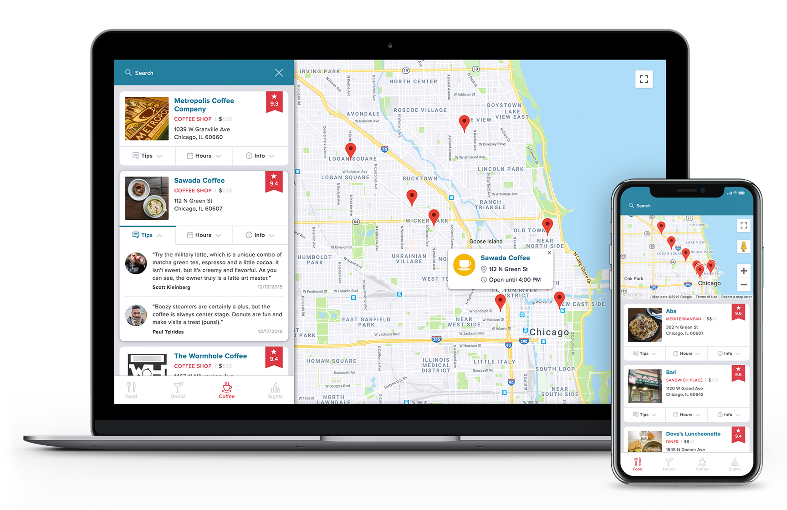

# Project Overview

This single page application features an interactive map that displays museum locations around Chicago. It was built with JavaScript and React and utilizes asynchronous APIs.

## Project Details

- The Google Maps API is used to generate the map. The Foursquare API is then called to display data about the museums and populate the markers.
- Clicking a location on the sidebar will open an info window containing additional information fetched from the FourSquare API. It will also animate its associated map marker.
- The sidebar contains an input field that can be used to filter the museum names and location markers. As you type in the input field, the map will zoom in on the matching locations. If your search returns a single location, the info window will automatically be displayed.
- Clicking on the map will close the sidebar on smaller screen sizes and mobile devices.
- The sidebar can be accessed using the keyboard by pressing enter on the navigation menu. You can then tab through the museum names and press enter to display the info window.

## Running Instructions

### Development Mode

- Download or Clone the Repository.
- Install all project dependencies with `npm install`
- Start the server with `npm start`
- A new browser window open automatically displaying the app. If it doesn't, navigate to [http://localhost:3000/](http://localhost:3000/) in your browser.

### Production Mode

- To create a production build use `npm run build`
- Navigate to the build directory and start the server with `npm run deploy`
- **Note:** _The service worker for this app will only cache the site when it is in production mode._

### Create React App

This project was bootstrapped with [Create React App](https://github.com/facebookincubator/create-react-app).
